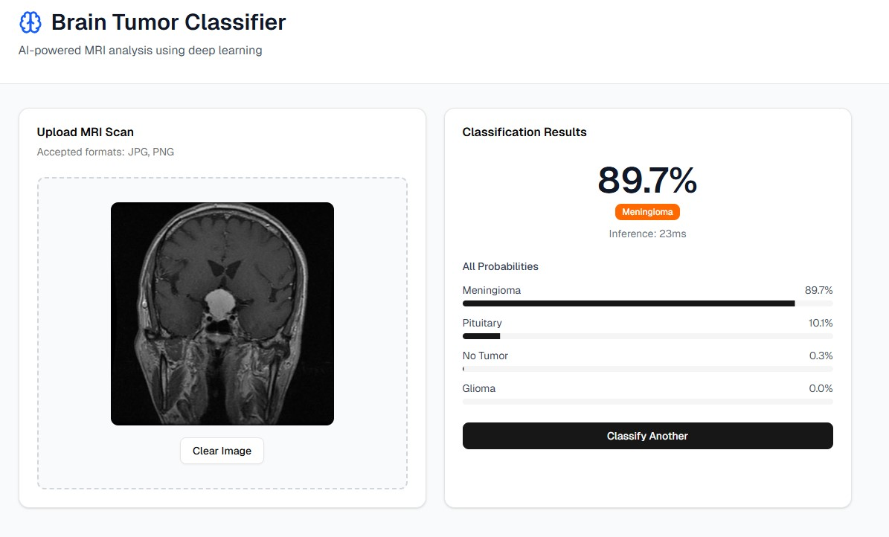
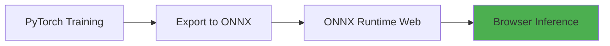

# 🧠 Brain Tumor Classifier Web

[](https://nextjs.org/)
[](https://onnxruntime.ai/)
[](https://www.typescriptlang.org/)
[](#license)
[](https://your-app.vercel.app)

> **AI-powered brain tumor classification running entirely in your browser** — No server required, complete privacy.

Transform PyTorch deep learning models into real-time web applications with ONNX Runtime Web. This project demonstrates end-to-end ML deployment from training to production-ready inference.

<div align="center">
  
</div>

---

## ⚠️ IMPORTANT MEDICAL DISCLAIMER

**THIS IS NOT A MEDICAL DEVICE** — Educational and research purposes only.

- ❌ **DO NOT** use for clinical diagnosis
- ❌ **DO NOT** make treatment decisions based on predictions
- ✅ **DO** consult qualified healthcare professionals for medical advice
- ✅ **DO** use validated, FDA-approved devices for clinical applications

See full [DISCLAIMER](#-disclaimer) below.

---

## ✨ Key Features

### 🚀 **Blazing Fast Inference**
- **200-400ms** predictions (after warmup)
- **WebGL-accelerated** computation
- No server roundtrip — everything runs locally

### 🔒 **Complete Privacy**
- **100% client-side** inference
- Your images **never leave your device**
- No data collection or tracking

### 🎯 **High Accuracy**
- **95.4% test accuracy** on validation set
- 4 tumor classes: Glioma, Meningioma, Pituitary, No Tumor
- Trained on 7,000+ brain MRI images

### ⚡ **Modern Tech Stack**
- **Next.js 15** with React Server Components
- **ONNX Runtime Web** for browser inference
- **TypeScript** for type safety
- **TailwindCSS + shadcn/ui** for beautiful UI

### 📱 **Universal Access**
- Works on **any modern browser** (Chrome, Firefox, Safari, Edge)
- **Responsive design** — mobile, tablet, desktop
- **Offline-capable** after first model load
- **No installation** required

---

## 🎯 Live Demo

Try it now: **[https://brain-tumor-ai-web.vercel.app/](https://brain-tumor-ai-web.vercel.app/)**

Or run locally in 30 seconds:

```bash
git clone https://github.com/Repetto-A/BrainTumorAI-Web.git
cd BrainTumorAI-Web
npm install
npm run dev
# Open http://localhost:3000
```

---

## 🏗️ Architecture

### From PyTorch to Production



### Tech Stack

```
Frontend (Next.js 15)
├── React 18 — UI components
├── TypeScript — Type safety
├── TailwindCSS — Styling
└── shadcn/ui — UI primitives

ML Inference (ONNX Runtime Web)
├── WebGL Backend — GPU acceleration
├── WebAssembly — Fallback computation
└── ONNX Model — 30MB, 8.4M parameters

Model Architecture
├── 3x Conv2D layers (32→64→128 filters)
├── MaxPooling for downsampling
├── Fully connected layers (256 units)
├── Dropout (0.5) for regularization
└── 4 output classes
```

---

## 🚀 Quick Start

### Prerequisites

- **Node.js 18+** (or use [nvm](https://github.com/nvm-sh/nvm))
- **npm** or **pnpm**

### Installation

```bash
# 1. Clone the repository
git clone https://github.com/Repetto-A/BrainTumorAI-Web.git
cd BrainTumorAI-Web

# 2. Install dependencies
npm install

# 3. Start development server
npm run dev

# 4. Open browser
open http://localhost:3000
```

### Build for Production

```bash
npm run build
npm start
```

---

## 📂 Project Structure

```
BrainTumorAI-Web/
├── app/
│   ├── layout.tsx              # Root layout with metadata
│   └── page.tsx                # Main classifier interface
├── lib/
│   ├── modelService.ts         # ONNX Runtime Web service
│   ├── useModel.ts             # React hook for model state
│   └── utils.ts                # Utility functions
├── components/
│   └── ui/                     # shadcn/ui components
├── public/
│   ├── model/
│   │   └── brain_tumor_model.onnx  # 30MB ONNX model
│   └── *.jpg                   # Sample MRI images
├── next.config.mjs             # Next.js + WASM config
├── package.json                # Dependencies
└── README.md                   # This file
```

---

## 🎨 How It Works

### 1. **Model Loading**

```typescript
// lib/modelService.ts
import * as ort from 'onnxruntime-web';

const session = await ort.InferenceSession.create('/model/brain_tumor_model.onnx', {
  executionProviders: ['webgl', 'wasm'],
  graphOptimizationLevel: 'all',
});
```

### 2. **Image Preprocessing**

Images are preprocessed to match PyTorch training:

```typescript
// Resize to 128×128
// Normalize: (pixel/255 - 0.5) / 0.5
// Format: channels-first [1, 3, 128, 128]
```

### 3. **Inference**

```typescript
const tensor = new ort.Tensor('float32', inputData, [1, 3, 128, 128]);
const results = await session.run({ input: tensor });
const probabilities = softmax(results.output.data);
```

### 4. **Display Results**

Predictions with confidence scores displayed as interactive bars.

---

## 🧪 Model Details

### Architecture

```
Input: 128×128×3 RGB image
    ↓
Conv2D(3→32) + ReLU + MaxPool(2×2)
    ↓
Conv2D(32→64) + ReLU + MaxPool(2×2)
    ↓
Conv2D(64→128) + ReLU + MaxPool(2×2)
    ↓
Flatten → 32,768 features
    ↓
Dense(32768→256) + ReLU + Dropout(0.5)
    ↓
Dense(256→4) — Output logits
    ↓
Softmax → Class probabilities
```

### Training Details

- **Framework**: PyTorch 2.0+
- **Dataset**: [Brain Tumor MRI Dataset](https://www.kaggle.com/datasets/masoudnickparvar/brain-tumor-mri-dataset) (7,023 images)
- **Epochs**: 25
- **Optimizer**: AdamW (lr=0.001)
- **Data Augmentation**: Random flips, rotations, color jitter
- **Test Accuracy**: **95.4%**

### Classes

| Class | Description | Training Samples |
|-------|-------------|------------------|
| **Glioma** | Most common malignant brain tumor | ~1,621 |
| **Meningioma** | Usually benign tumor of meninges | ~1,645 |
| **Pituitary** | Tumor of pituitary gland | ~1,757 |
| **No Tumor** | Healthy brain scan | ~2,000 |

---

## 🌐 Deployment

### Recommended: Vercel (Free)

[](https://vercel.com/new/clone?repository-url=https://github.com/Repetto-A/BrainTumorAI-Web)

**Automatic deployment:**
1. Push to GitHub
2. Connect repo on [vercel.com](https://vercel.com)
3. Click "Deploy"
4. Done! 🎉

**Vercel handles:**
- ✅ Next.js optimization
- ✅ Static asset compression (reduces 30MB → ~15MB)
- ✅ CDN distribution
- ✅ HTTPS/SSL
- ✅ Automatic preview deployments

### Alternative: Netlify (Free)

```bash
npm run build
# Drag .next folder to netlify.com
```

### Self-Hosted (Docker)

```dockerfile
FROM node:18-alpine
WORKDIR /app
COPY package*.json ./
RUN npm ci --only=production
COPY . .
RUN npm run build
EXPOSE 3000
CMD ["npm", "start"]
```

```bash
docker build -t BrainTumorAI-Web .
docker run -p 3000:3000 BrainTumorAI-Web
```

---

## 🎓 Educational Use Cases

### For Students

- Learn **PyTorch → ONNX** conversion workflow
- Understand **browser-based ML inference**
- Practice **Next.js** and modern React patterns
- Explore **medical AI** applications

### For Researchers

- **Rapid prototyping** of ML models
- **Demo deployment** without backend infrastructure
- **Privacy-preserving** inference (no data upload)
- **Cross-platform** testing environment

### For Developers

- **End-to-end ML pipeline** example
- **Production-ready** TypeScript patterns
- **Modern web stack** implementation
- **Performance optimization** techniques

---

## 📊 Performance Benchmarks

| Metric | Value |
|--------|-------|
| Model size (ONNX) | 30MB |
| Model size (compressed) | ~15MB (Vercel CDN) |
| First load time | 2-5s (model download) |
| First prediction | 500-1000ms (GPU warmup) |
| Subsequent predictions | 200-400ms |
| Memory usage | ~150MB peak |
| Supported browsers | Chrome, Firefox, Safari, Edge |

*Tested on Chrome 120, Intel i5, integrated GPU*

---

## 🛠️ Development

### Scripts

```bash
npm run dev      # Start dev server (localhost:3000)
npm run build    # Build for production
npm start        # Start production server
npm run lint     # Run ESLint
```

### Environment Variables

Create `.env.local` (optional):

```bash
NEXT_PUBLIC_MODEL_PATH=/model/brain_tumor_model.onnx
```

### Key Files

- **`lib/modelService.ts`** — ONNX model loading & inference
- **`lib/useModel.ts`** — React hook for model state
- **`app/page.tsx`** — Main UI component
- **`next.config.mjs`** — WebAssembly configuration

---

## 🔧 Troubleshooting

### Model not loading

**Error**: `Failed to load ONNX model`

**Solution**:
1. Verify `public/model/brain_tumor_model.onnx` exists (30MB)
2. Check browser console for CORS errors
3. Clear cache: `rm -rf .next`

### WebGL not available

**Warning**: `WebGL not available, using WebAssembly`

**Solution**: This is normal! WASM is the fallback and works fine. For WebGL:
- Use Chrome/Edge (best WebGL support)
- Check `chrome://gpu/` to verify WebGL enabled
- Update graphics drivers

### Slow predictions

**Issue**: Predictions take > 2 seconds

**Solutions**:
- First prediction is always slower (GPU warmup)
- Subsequent predictions should be 200-400ms
- Close other GPU-intensive tabs
- Try Chrome for better WebGL performance

---

## 🤝 Contributing

Contributions welcome! Areas of interest:

- [ ] Add **Grad-CAM** visualization for explainability
- [ ] Implement **batch prediction** for multiple images
- [ ] Add **PDF export** of results
- [ ] Support **DICOM** medical image format
- [ ] Create **PWA** for offline use
- [ ] Add **unit tests** for model service

**How to contribute:**

1. Fork the repo
2. Create feature branch: `git checkout -b feature/amazing-feature`
3. Commit changes: `git commit -m 'Add amazing feature'`
4. Push to branch: `git push origin feature/amazing-feature`
5. Open Pull Request

---

## ⚠️ DISCLAIMER

### THIS IS NOT A MEDICAL DEVICE

This software is a **research and educational project ONLY**.

### ❌ DO NOT USE FOR:

- Clinical diagnosis or screening
- Treatment planning or decisions
- Patient care or management
- Any medical or clinical purpose

### ⚠️ Critical Limitations

1. **Not Clinically Validated**: No clinical trials or regulatory approval
2. **Dataset Specific**: Performance may not generalize to real-world data
3. **Research Prototype**: Not tested in clinical settings
4. **No Guarantees**: Results may be incorrect or misleading

### Factors Affecting Real-World Performance

- MRI scanner differences (manufacturer, model, settings)
- Image acquisition protocols and parameters
- Patient demographics and tumor characteristics
- Image quality, artifacts, and resolution
- Slice selection and positioning variations

### Legal Notice

**THE AUTHORS ASSUME NO LIABILITY FOR:**
- Misuse of this software
- Incorrect predictions or interpretations
- Medical decisions based on this software
- Any harm resulting from use

**Always consult qualified healthcare professionals and use FDA-approved medical devices.**

---

## 📄 License

This project is released into the **public domain** (Unlicense).

**No warranty**: Provided "as-is" without any warranty.

**Dataset**: [Brain Tumor MRI Dataset](https://www.kaggle.com/datasets/masoudnickparvar/brain-tumor-mri-dataset) has its own license on Kaggle.

---

## 🙏 Acknowledgments

- **Dataset**: [Masoud Nickparvar](https://www.kaggle.com/masoudnickparvar) via Kaggle
- **Framework**: [PyTorch](https://pytorch.org/) for model training
- **Runtime**: [ONNX Runtime Web](https://onnxruntime.ai/) for browser inference
- **UI**: [shadcn/ui](https://ui.shadcn.com/) for beautiful components

---

## 📚 Related Project

- **PyTorch Training Code**: [Brain Tumor Classifier](https://github.com/Repetto-A/Brain-Tumor-Classifier)


---

## 📈 Citation

If you use this project in your research:

```bibtex
@software{brain_tumor_classifier_web,
  author = {Your Name},
  title = {Brain Tumor Classifier Web: Browser-Based Deep Learning Inference},
  year = {2025},
  url = {https://github.com/Repetto-A/BrainTumorAI-Web},
  note = {ONNX Runtime Web implementation}
}
```

**Dataset Citation**:
```bibtex
@misc{nickparvar_brain_tumor_mri,
  author = {Masoud Nickparvar},
  title = {Brain Tumor MRI Dataset},
  year = {2021},
  publisher = {Kaggle},
  url = {https://www.kaggle.com/datasets/masoudnickparvar/brain-tumor-mri-dataset}
}
```

---

<div align="center">

**⭐ Star this repo if you find it useful!**

Made with ❤️ for the ML community

[Report Bug](https://github.com/Repetto-A/BrainTumorAI-Web/issues) · [Request Feature](https://github.com/Repetto-A/BrainTumorAI-Web/issues) · [View Demo](https://your-app.vercel.app)

</div>
